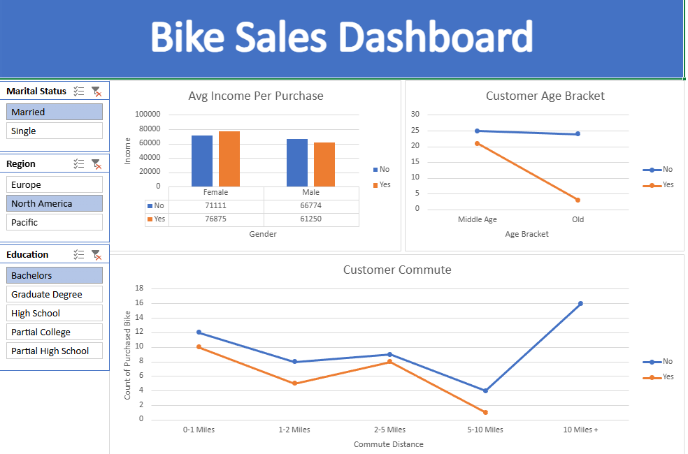

# Bike Buyers Data Analysis Dashboard (Excel)

## Project Overview

This project analyzes a bike buyers dataset using Microsoft Excel to identify patterns in customer demographics and purchasing behavior.

The project demonstrates the process of cleaning raw data, preparing it for analysis, and building interactive dashboards using Pivot Tables and slicers.

The goal is to transform raw customer data into insights that help understand which customer segments are more likely to purchase bicycles.

---

## Dataset

The dataset contains demographic and purchasing information about customers.

Key columns include:

- **ID** – Unique identifier for each customer
- **Marital Status** – Marital status of the customer
- **Gender** – Gender of the customer
- **Income** – Customer annual income
- **Children** – Number of children
- **Education** – Education level
- **Occupation** – Job category
- **Home Owner** – Whether the customer owns a home
- **Cars** – Number of cars owned
- **Commute Distance** – Distance traveled to work
- **Region** – Geographic region
- **Age** – Age of the customer
- **Purchased Bike** – Whether the customer purchased a bike

---

## Data Cleaning Steps

The following cleaning steps were performed in Excel:

1. Created a working copy of the raw dataset to preserve original data.
2. Standardized **Marital Status** values (`M` → `Married`, `S` → `Single`).
3. Standardized **Gender** values (`M` → `Male`, `F` → `Female`).
4. Created a new **Age Bracket** column to categorize customers by age group.
5. Prepared the dataset for pivot table analysis.

These steps improved the readability and usability of the dataset for analysis.

---

## Analysis Objectives

The dashboard aims to explore questions such as:

- Which income groups are more likely to purchase bikes?
- How does commute distance affect bike purchases?
- Which age groups are more likely to buy bikes?
- How do marital status and gender influence bike purchases?

---

## Excel Skills Demonstrated

This project demonstrates several important Excel skills used in business analysis:

- Data cleaning in Excel
- Data standardization
- Creating calculated columns
- Pivot Table analysis
- Dashboard creation
- Interactive filters using slicers
- Data aggregation and segmentation

---

## Tools Used

- Microsoft Excel
- Pivot Tables
- Excel Dashboard Design
- GitHub for project hosting

---

## Dashboard Preview

The dashboard provides a visual overview of bike purchasing trends using:

- Pivot charts
- Customer segmentation
- Interactive slicers

The dashboard helps quickly identify patterns in customer demographics and purchasing behavior.

## Dashboard Preview

  

---

## Key Insights

From the analysis, several patterns can be observed:

- Customers with **higher income levels** tend to purchase bikes more frequently.
- **Middle-aged customers** appear to be the most active buyers.
- Customers with **shorter commute distances** show higher likelihood of buying bikes.
- Demographic factors such as **marital status and gender** can influence purchasing behavior.

These insights can help businesses better understand their target customer segments.

---

## Data Source

The dataset used in this project is the **Bike Buyers dataset**, commonly used for Excel data analysis practice.

The dataset was used for educational purposes to demonstrate Excel data cleaning, pivot analysis, and dashboard creation.

---

## Course Context

This project was completed while following Excel data analysis tutorials from **Alex The Analyst**.

The tutorial demonstrates how Excel can be used for data cleaning, analysis, and dashboard creation in a business analytics workflow.

---

## Author

Nadim Abdu Nassar

Business Analyst | SQL | Excel | Power BI

GitHub: https://github.com/nadimpk1
